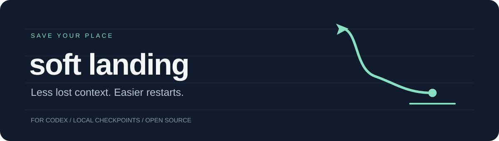

<p align="center"></p>
<h1 align="center">Soft Landing</h1>
<p align="center"><strong>Help your coding agent save its progress before it hits a usage limit.</strong></p>
<p align="center"><strong>Currently Codex only.</strong> Support for more coding agents is coming soon.</p>
<p align="center"><a href="https://github.com/c0ntrix/soft-landing/releases">Download</a> &middot; <a href="INSTALLATION.md">Install</a> &middot; <a href="docs/CLI.md">CLI guide</a> &middot; <a href="https://github.com/c0ntrix/soft-landing/issues">Feedback</a></p>

A usage limit can interrupt a task while the agent is still working. When you
return, you need to know which changes are finished, which checks actually ran,
and what still needs attention.

Soft Landing watches your Codex allowance and asks the agent to write that handoff
while it still has room to respond. It saves checkpoints during the task, requests
a pause when quota gets low, and checks the saved state against your files when
you resume. The aim is to spend less time reconstructing the task before continuing.

## Install

Ask Codex:

```text
Install Soft Landing from https://github.com/c0ntrix/soft-landing.
Follow INSTALLATION.md and use the release for my operating system.
```

Or [download the ZIP for your computer](https://github.com/c0ntrix/soft-landing/releases),
extract it, and open **INSTALL.cmd** on Windows or **INSTALL.command** on Mac.
The runtime is included. No separate Node installation, administrator access or API key.

You need Codex installed and signed in with ChatGPT. Open a new Codex task after
installation; restart the app if the skill does not appear.

## Use it

```text
Use $soft-landing to start this task in my project: review the failing tests and fix the cause.
```

Later:

```text
Use $soft-landing to show my saved tasks and resume the paused one.
```

Prefer a menu? Open **Soft Landing** on your desktop. Choose a project, describe
the task, and leave the window open while it works.

**Soft Landing manages tasks started through it. It does not attach to a task
already running in the Codex desktop app.**

## What happens when quota gets low?

| Remaining quota | Soft Landing |
| --- | --- |
| Above 20% | Works normally and records milestone checkpoints. |
| 20% or less | Warns the running agent and asks it to save its place. |
| 10% or less | Requests an orderly pause and blocks new turns. |
| Ready to return | You resume; Codex checks the saved state and actual files first. |

Thresholds are configurable. Monitoring runs outside the model and makes no model
calls. Task execution still uses your existing Codex allowance.

A saved checkpoint can look like this *(illustrative example)*:

```text
Done       Updated the parser; unit tests passed.
Files      src/parser.js, test/parser.test.js
Open       Integration test has not run yet.
Next       Run the integration test before changing anything else.
```

## What you are installing

A local controller, a Codex skill, a menu, and the official Node runtime.
The installer copies these into your personal skill folder and adds a desktop
launcher. It does not install a service, edit PATH or change system-wide security settings.

- **Source available:** MIT license; readable code and installer scripts.
- **Local records:** checkpoints and tool outcomes stay in your project.
- **No extra account:** Codex owns sign-in; Soft Landing does not read login tokens.
- **Inspectable downloads:** pinned Node checksums, per-file manifests and ZIP hashes.
- **No controller telemetry:** Codex retains its own normal network behavior.

See [trust and security notes](SECURITY.md) for what the tool can access.

## Status and limits

Early beta. Packages target Windows x64, macOS Apple Silicon and macOS Intel.
See [validation status](docs/TEST-REPORT.md) for what has actually been tested.

A quota warning cannot guarantee a timely stop. Other tasks can consume the same
account allowance. A checkpoint is not a backup of file contents. Interactive
approval dialogs and automatic resume are not supported. One completed turn does
not necessarily mean the entire objective is done.

Currently **Codex only**. The name stays open to other coding agents; the current
quota monitoring and task controls use Codex's interface. Claude Code and other
clients need their own integrations, not just a copied skill file. See the
[client support and expansion path](INSTALLATION.md#supported-clients).
This is an independent project, not an OpenAI product.

## Development

Node.js 22+ for source use; Python 3.10+ for release packaging.

```sh
node --test test/*.test.js
node src/cli.js doctor
python scripts/build-release.py --platform all
```

No npm dependencies. [Architecture](docs/INTEGRATION.md) -
[Contributing](CONTRIBUTING.md) - [Changelog](CHANGELOG.md)

If it made your next restart easier, a star or a concrete bug report helps.
