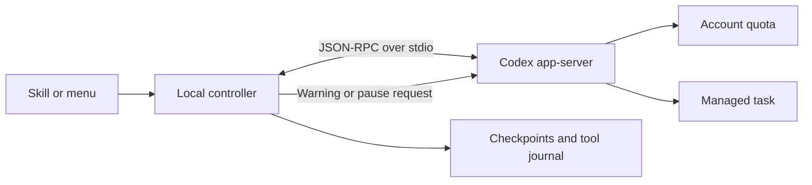

# Architecture

Soft Landing starts its own Codex app-server over stdio. It does not read desktop
databases, attach to active desktop tasks or use session-private app tools.

The [official protocol](https://learn.chatgpt.com/docs/app-server) provides quota
reads/events, thread creation, turn start, steering, interruption and thread resume.
The original Windows integration used CLI 0.153.4. The interface is experimental;
compatibility with other versions requires testing.

- `rpc.js`: subprocess lifetime, request correlation, timeouts, notifications.
- `limits.js`: pure quota interpretation, thresholds, resets, stale data.
- `controller.js`: preflight, steering, pause deadlines, task lifecycle.
- `store.js`: checkpoints, file hashes, durable journals, workspace locks.
- `environment.js` / `doctor.js`: executable discovery, read-only setup checks.
- `cli.js` / `menu.js`: user entrypoints.

Only start/resume begins a model turn. Quota polling supplements events to detect
other sessions' consumption. Events received during an outstanding read take
precedence over its possibly older result. Sparse/reordered data does not silently
replenish budget.

Agent checkpoint blocks arrive through ordinary text; validation and storage make
no extra model call. Agent claims about checks are distinct from observed tool
outcomes. Atomic writes and synchronized journals handle ordinary process crashes,
not every disk failure. Ambiguous side-effecting requests are not blindly retried.

Interactive approvals/forms are rejected and recorded as needing attention.
The selected sandbox stays enabled. No automatic reconnect/resume, usage reset or
quota purchase.

Platform-specific code is limited to discovery and installers. No Unix daemon is
needed. A native macOS CI run can establish installer/runtime behavior without a
Codex account; real model/authentication/sandbox behavior needs a signed-in Mac.

Other agent adapters need verified quota data, live warning delivery and durable
resume semantics. Hooks alone do not establish these. No other agent is supported yet.

